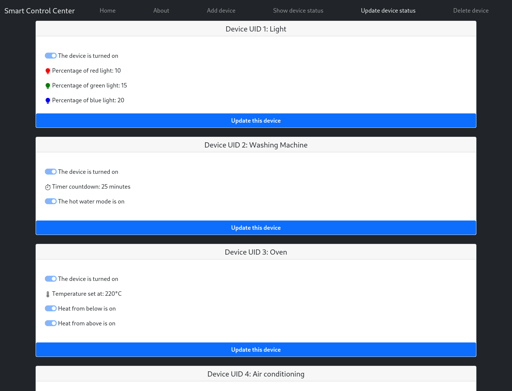

# Smart Home Device Manager




This is a web-based application for managing smart home devices. It uses Node.js with Express.js framework and MySQL database for data storage. The frontend is built with EJS templating engine.

## Features

- Create, Read, Update, Delete (CRUD) operations for managing smart home devices.
- Responsive user interface with a modern and intuitive design.
- Dockerized application for easy deployment and scalability.

## Installation

To run this application on your local machine, follow these steps:

- Clone this repository: ```git clone https://github.com/ezema/CRUD-Node.js-Express-EJS-MySQL-Docker.git```.
- Optional: modify the ```.env``` file with the values of your choosing.
- Run the following command to start the application: ```docker-compose up -d```.

## Usage

Once the application is up and running, you can access it by visiting http://localhost:8089 in your web browser. 

You can navigate to the Devices page where you can view, add, edit, and delete smart home devices. The user interface is simple and intuitive, making it easy to manage your smart home devices.

## Contributing

Contributions are always welcome! If you have any suggestions or find a bug, please open an issue or submit a pull request.